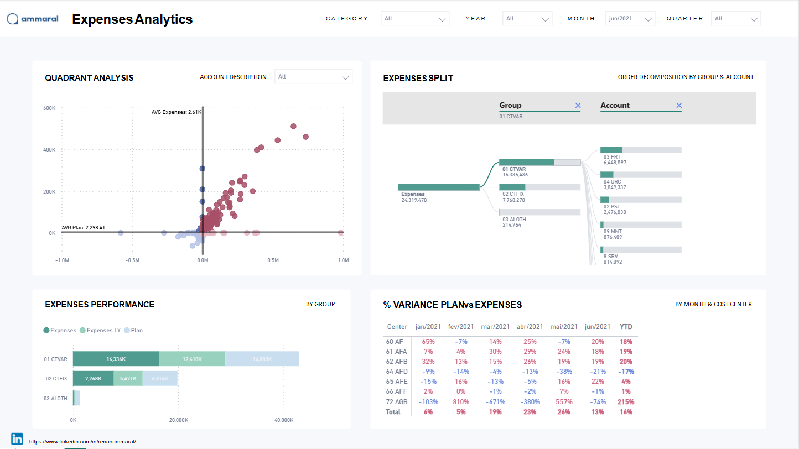
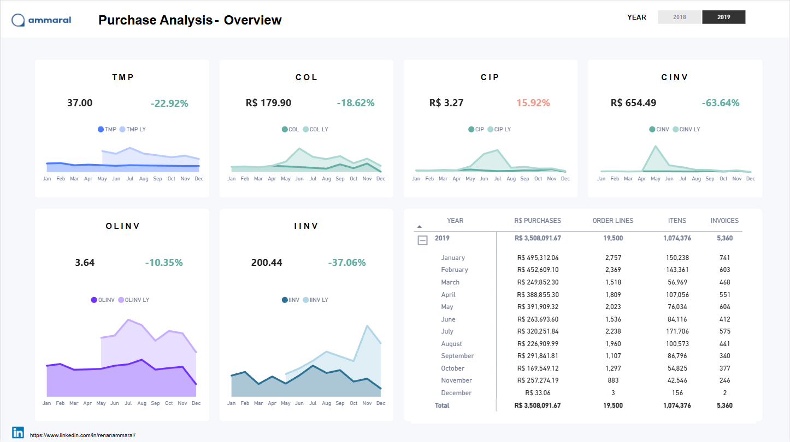
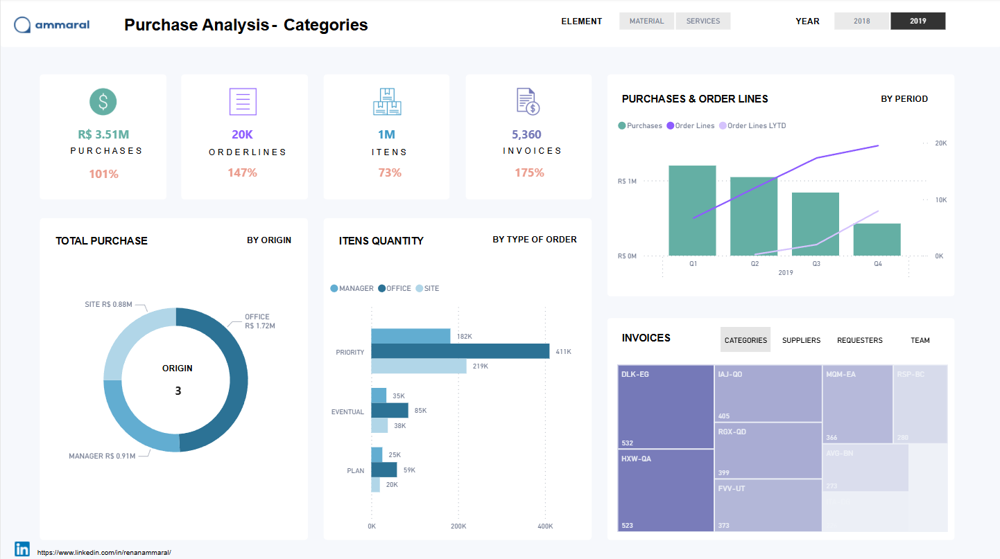
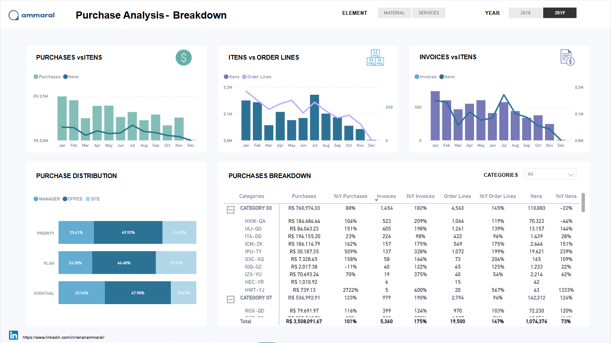
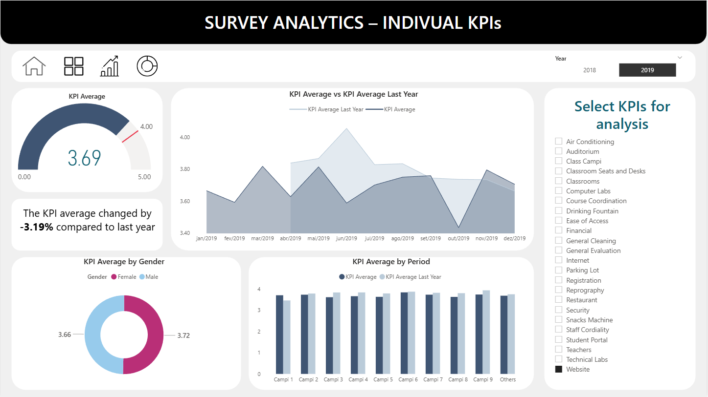
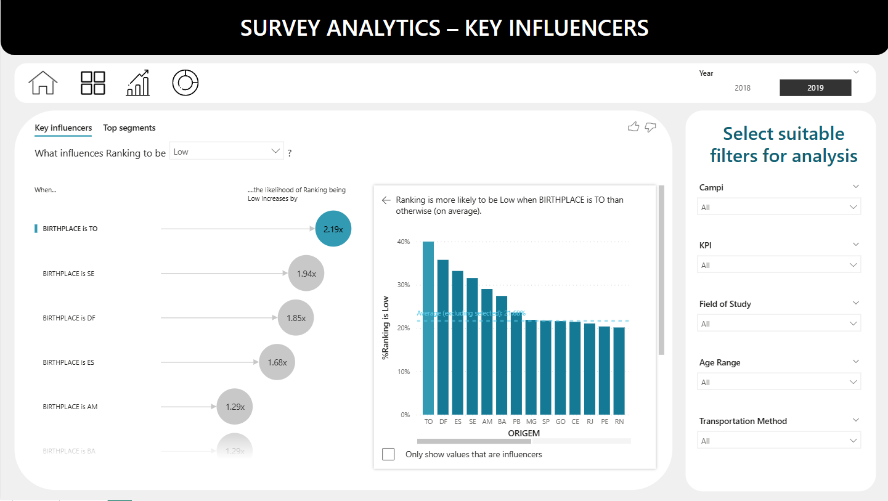
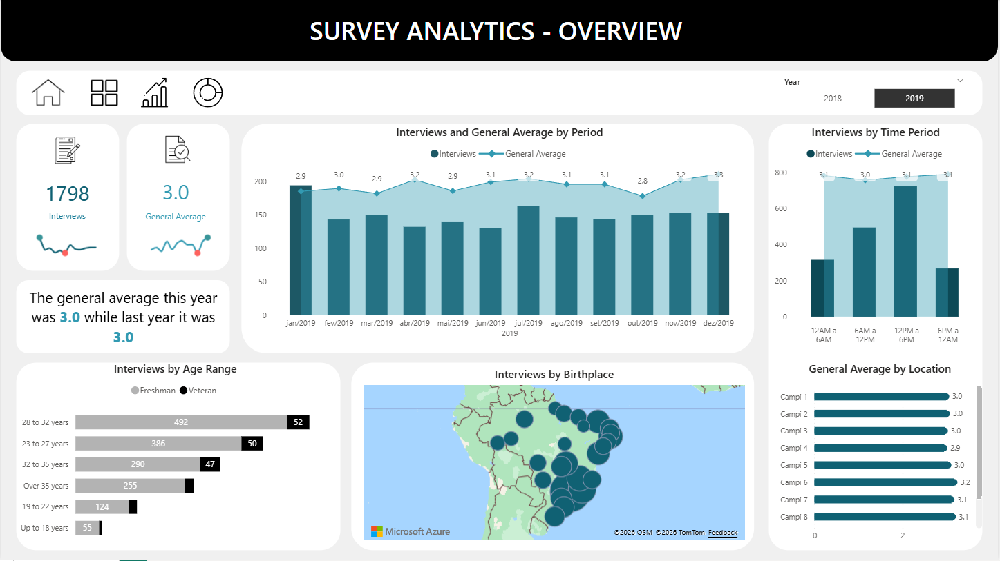

# Data Analyst & Data Scientist

## About Me

As a Data Analyst and Power BI expert, I have led impactful business intelligence (BI) projects to enhance commercial performance and operational efficiency at five major airports in Brazil, collaborating with global companies such as VINCI Airports and AENA. Currently, I am consulting and mentoring in the Advanced Analytics team at Dataside, where I have worked on strategic pricing and e-commerce projects for Unilever and led the migration of Tableau dashboards to Power BI for Hyundai Motors Brazil.

Currently transitioning from Data Analyst to Data Scientist, applying machine learning techniques through personal projects and MVPs. Gaining end-to-end experience in creating, deploying and monitoring machine learning models.

## Notable Achievements:
- Delivered more than 25 BI projects using Power BI
- Generated over BRL 25M in savings through BI projects
- Achieved a 94.3% reduction in Power BI consumption through model and DAX optimization
- Supported commercial and operational performance improvements across five major airports in Brazil
- Delivered analytics solutions for PepsiCo, Unilever (pricing & e-commerce intelligence) and Hyundai Motors Brazil (full dashboard migration from Tableau to Power BI)

## Technical Skills
**Data & Analytics**
- SQL • Power BI • Excel  
- Python (Pandas, NumPy, Matplotlib, Seaborn)  

**Machine Learning & Statistics**
- Scikit-learn • Statsmodels • MLflow  

**APIs, Apps & Deployment**
- FastAPI • Streamlit • Docker  

**Data Platforms & BI Tools**
- Databricks  
- Tabular Editor • DAX Studio  
- SQL Server Management Studio (SSMS)  
- ALM Toolkit • VertiPaq Analyzer  

**Design & Prototyping**
- Figma

## Soft Skills
- Critical Thinking & Problem-Solving
- Attention to Detail
- Curiosity and Continuous Learning
- Time Management, Collaboration, and Teamwork
- Business Acumen & Communication

## Education
- Bachelor of Science in Civil Engineering - Universidade Salvador (2012 to 2017)
- Technologist in Computer Networks - Universidade Salvador (2009 to 2011)

## Work Experience
**Data Analyst and PowerBI Developer @ Dataside**
- Led over 25 data projects with Microsoft Power BI, executing end-to-end solutions, which improved data accessibility and decision-making efficiency across multiple business units.
- Optimized large-scale tabular models in Power BI environments with external tools to fine-tune performance and semantic models, reducing resource consumption and data processing time by up to 94,3%.
- Collaborated with Engineering and Data Governance teams on cross-functional projects, implementing data validation workflows and compliance standards, strengthening quality, security and data integrity.
- Mentored a team of 11+ data analysts, providing hands-on training in Excel, SQL and Power BI enhancing team proficiency, analytical thinking and overall project delivery quality.
- Led enterprise-wide BI migration from Tableau to Microsoft Fabric/Power BI, successfully transitioning 25+ reports and 30+ datasets within 5-month deadline while delivering substantial licensing cost savings

**Data Analyst and PowerBI Developer @ Orbe Experience**
- Spearheaded Power BI migration at Salvador Airport (VINCI Airports), replacing Excel-based analyses with automated KPI monitoring that delivered BRL 13.6M in annual contract bonuses and penalty avoidance
- Designed revenue monitoring system for airport retail concessionaires, providing predictive analytics that increased commercial revenues by BRL 7M annually through optimized leasing decisions and forecasting
- Reduced aircraft turnaround time by 12 minutes through root-cause analysis of ground services, unlocking 8% capacity increase without capital investment
- Implemented airline SLA monitoring across passenger touchpoints (check-in, baggage, security), driving 20% improvement in passenger satisfaction scores through data-driven accountability
- Partnered with cross-functional stakeholders across airport operations, airlines, retail, and executive leadership to drive operational improvements through data analytics

**Civil Engineering @ Caixa Economica Federal**
- Increased maintenance SLA from 63% to 85% across 637 branches in 3 states by developing data-driven prioritization methodology that combined maintenance planning with inspection reports, enabling shift from reactive to preventive maintenance

**Civil Engineering @ DAG Construtora**
- Managed end-to-end construction budgeting and planning processes including quantity take-offs, cost estimation, WBS creation, and performance tracking using S-curves and completion forecasts
- Built predictive model using simple linear regression on historical precipitation data to estimate working day impacts, differentiating between outdoor and indoor activities to improve construction schedule reliability

## Bootcamps & Trainings
- Data Scientist Training – Data Science Academy (2025)
- Machine Learning Specialization – Stanford Online (2025)
- MLOps Bootcamp - Udemy(2025)

## Professional Certifications
- Power BI Data Analyst Associated (PL 300) – Microsoft (2024) – Active.
- Azure AI Fundamentals (AI 900) – Microsoft (2025) – Active.
- Google Data Analytics Professional Certificate – Coursera (2023)
- Data Modeling for Power BI – SQLBI (2022)

## Projects & Portfolio

### Data Science & Machine Learning
[Turnaround Analysis For Airlines](https://github.com/raoliveirads/turnaround-project)

Turnaround is one of the most critical processes in airport operations, as it directly affects the efficiency, punctuality, and profitability of airlines. This term refers to the time required for an aircraft to complete all ground activities between landing and the next takeoff. The faster and more efficient this process is, the lower the operational costs and the greater the airport’s capacity to handle a higher volume of flights. Optimizing turnaround reduces delays, improves punctuality, and increases operational efficiency, positively impacting the reputation of both airlines and airports. Moreover, a well-managed turnaround enables better fleet utilization, contributing to the sustainability of the aviation sector.

### Data Analytics & Power BI
**Spend Analysis**

This Power BI project delivered an interactive expense analysis dashboard that provides consolidated visibility into company spending, which is essential for large multinational organizations to control costs, monitor key financial indicators, and support data-driven decisions across multiple regions and cost centers. By centralizing data and enabling real-time monitoring of expenses and performance, the solution helped identify inefficiencies and optimization opportunities, resulting in a return on investment (ROI) of approximately 18% within the first year.

**Purchase Analysis**

This Power BI project delivered an interactive purchasing analysis dashboard that provides consolidated visibility into procurement data, which is essential for large organizations to control purchasing activities, monitor key procurement indicators, and support data-driven decisions across multiple suppliers, categories, and business units. By centralizing purchase data and enabling near real-time tracking of spend, supplier performance, and price variations, the solution helped identify inefficiencies, negotiate better terms, and optimize sourcing strategies, resulting in a return on investment (ROI) of approximately 20% within the first year.

**Satisfaction Survey Analysis**

This Power BI project delivered an interactive satisfaction survey dashboard designed to analyze feedback from students, faculty, and staff, supporting a university during its expansion across Brazil. Consolidating survey data into a single analytical view enabled leadership to monitor key satisfaction indicators, compare results across campuses and regions, and identify critical improvement opportunities. By providing timely insights into academic quality, infrastructure, and student experience, the solution supported more informed strategic decisions and continuous improvement initiatives, resulting in a return on investment (ROI) of approximately 15% within the first year through improved retention, engagement, and operational efficiency.

