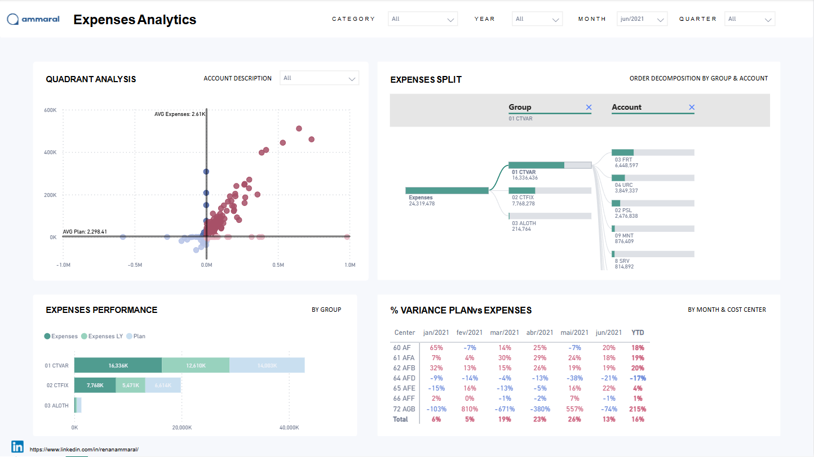
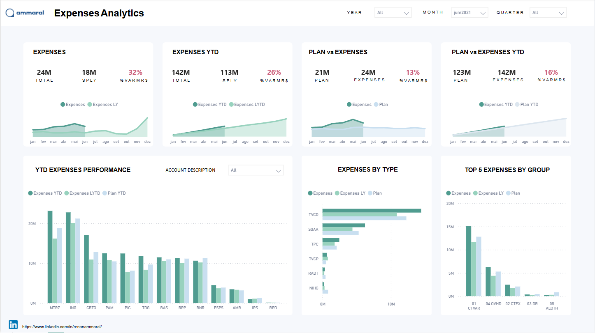
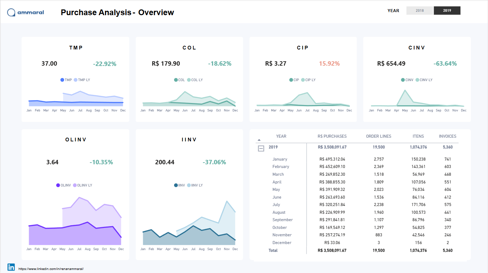
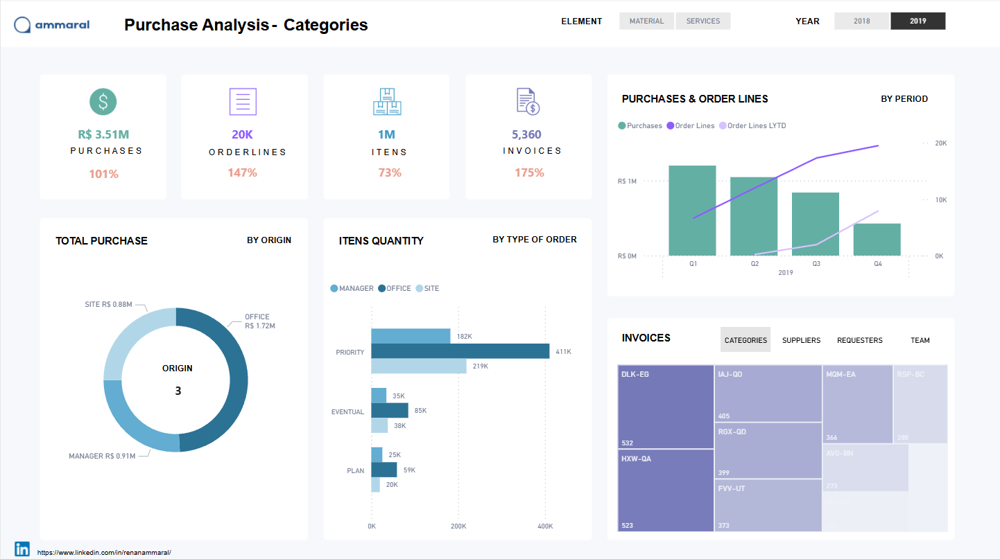
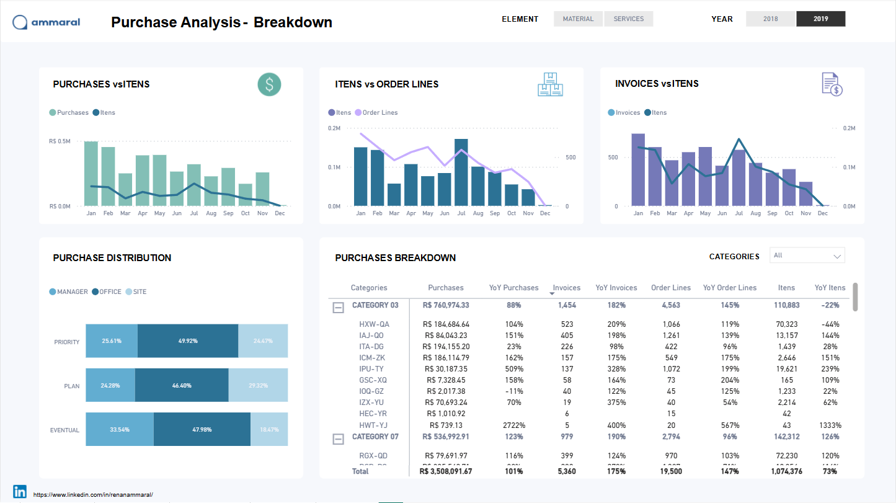
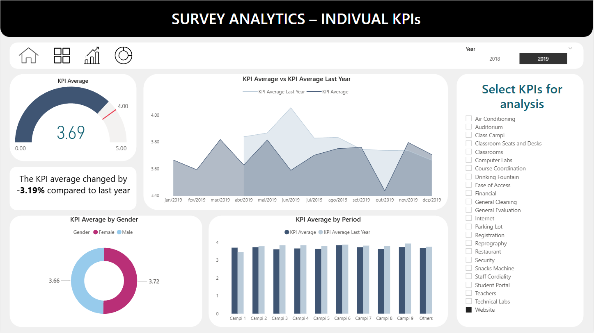
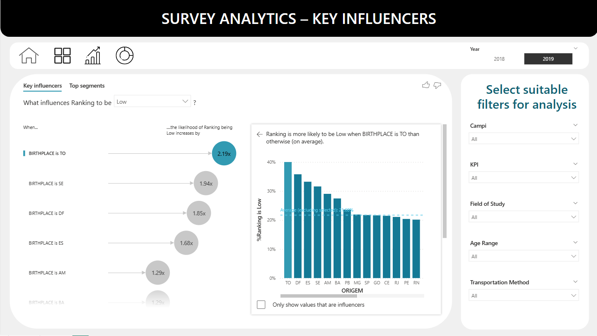
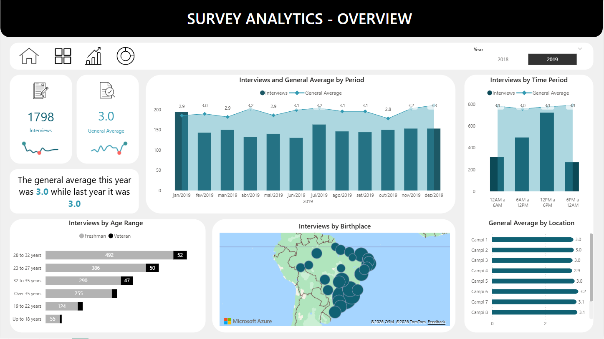

# Renan Amaral — Data Scientist
**Machine Learning & Generative AI** · Python · SQL · PySpark · Databricks

[Portfolio](https://raoliveirads.github.io) · [LinkedIn](https://www.linkedin.com/in/renanammaral/) · Salvador, Brazil

## About Me
Data Scientist focused on Machine Learning and Generative AI, with 7+ years turning data into business decisions — from predictive models to LLM-based solutions. My analytics and business background means I build models stakeholders understand and actually use — not just models that score well in a notebook.

## Currently at Indicium AI
- **AI agents in healthcare:** working on a live AI agent solution — validating outputs from 3 agents against medical records across 10+ hospitals, prompt evaluation, reviewing dbt models and BigQuery queries, and implementing prompt context caching to reduce cost and latency.
- **Forecasting + RAG on Databricks:** end-to-end project with Medallion architecture in PySpark and dbt, CI/CD, a demand forecasting model (**21% lower error vs. baseline**) and a RAG assistant with guardrails (**95% answer accuracy**).

## Notable Achievements
- **ATM replenishment forecasting** for a nationwide network: up to **15% reduction** in operational costs.
- **Customer propensity model**, built end-to-end, enabling targeted campaigns with a **5% conversion lift**.
- **NLP & Topic Modeling** (BERTopic) on 10K+ support tickets, shaping the official FAQ that **cut ticket volume by 67%**.
- **Airport analytics:** **BRL 13.6M/year** in contract bonuses and avoided penalties; airline SLA compliance raised **from 72% to 94%**; aircraft turnaround cut by **12 minutes** (8% extra capacity).
- **Team leadership:** led 10+ analysts in a Tableau → Microsoft Fabric/Power BI migration delivering **US$100K+ in annual savings**.

## Technical Skills
| Area | Tools & Techniques |
|---|---|
| **Machine Learning & Statistics** | Supervised & Unsupervised Learning · Time Series Forecasting · Feature Engineering · Hypothesis Testing · Scikit-learn · XGBoost · Statsmodels |
| **Generative AI & NLP** | LLMs · RAG · LLM Evaluation · Prompt Engineering · NLP · Topic Modeling (BERTopic) |
| **Languages & Data** | Python (Pandas, NumPy) · SQL · PySpark · dbt · Data Modeling |
| **MLOps & Deployment** | MLflow · CI/CD · Git & GitHub · Docker · FastAPI · Streamlit |
| **Platforms** | Databricks · GCP (BigQuery, Vertex AI) · Azure |
| **BI** | Power BI · Microsoft Fabric · DAX |

## Work Experience

**Data & AI Trainee @ Indicium AI** (2026 – Present)
- Built and benchmarked demand forecasting models (Ridge/Lasso, Random Forest, LightGBM/XGBoost, CatBoost) with time-based feature engineering, cutting forecast error by 21% vs. a moving-average baseline.
- Built a RAG assistant on Databricks (Vector Search, Qwen3 embeddings, GPT-OSS-20B) with PII and prompt injection guardrails, reaching 95% answer accuracy in evaluation.
- Validated outputs from 3 AI agents against medical records across 10+ hospitals and implemented prompt context caching on a production solution.
- Team effort: Medallion architecture with 30 tables in PySpark and dbt on Databricks (Unity Catalog), deployed via Databricks Asset Bundles and Bitbucket Pipelines.

**Data Scientist @ Dataside** (2025 – 2026)
- Built an ML demand forecasting model for a nationwide ATM network, tracked in MLflow, reducing unnecessary trips and cash-outs and delivering up to 15% savings in operational costs.
- Developed end-to-end a purchase propensity model from transactional data, enabling targeted campaigns with a 5% conversion lift.
- Applied Topic Modeling (BERTopic, benchmarked against LDA and NMF) to 10K+ support tickets; the resulting knowledge base shaped the official FAQ, which cut ticket volume by 67%.
- Built a Python pipeline generating a monthly support KPI report for leadership, replacing roughly one week per month of manual analysis.

**Senior Data Analyst @ Dataside** (2022 – 2025)
- Led a team of 10+ analysts migrating 25+ reports and 30+ datasets from Tableau to Microsoft Fabric/Power BI within 5 months, delivering US$100K+ in annual licensing savings.
- Refactored semantic models and DAX logic, cutting query and data processing time by up to 94.3%.
- Delivered 25+ end-to-end BI projects across manufacturing, retail, consumer goods, automotive, HR and engineering.
- Built a field monitoring system that flagged uncovered routes, increasing customer visits by 17%.

**Data Analyst @ Orbe Consultoria** (2019 – 2022)
- Led and delivered automated KPI monitoring (Power BI, SQL) at Salvador Airport (VINCI Airports), securing BRL 13.6M/year in contract bonuses and avoided penalties.
- Implemented airline and service-provider SLA monitoring, raising compliance from 72% to 94% and passenger NPS (ANAC criteria) by 20%.
- Statistical analysis of ground-handling steps identified bottlenecks that cut aircraft turnaround by 12 minutes (8% extra capacity).
- Built retail tenant performance dashboards that guided leasing decisions, contributing to BRL 7M/year in additional revenue.

**Civil Engineering Intern @ Caixa Econômica Federal and DAG Construtora** (2013 – 2016)
- Data-driven maintenance prioritization across 637 branches, raising maintenance SLA from 63% to 85%.
- Linear regression on rainfall data to estimate lost working days and improve schedule reliability.

## Education
- Postgraduate Specialization, Civil Engineering Management — SENAI CIMATEC (2017 – 2019)
- Bachelor's Degree, Civil Engineering — UNIFACS (2012 – 2017)
- Technologist, Computer Networks — UNIFACS (2009 – 2011)

## Certifications & Training
- Databricks Certified Generative AI Engineer Associate
- Databricks Certified Machine Learning Associate
- Machine Learning Specialization — Stanford Online / DeepLearning.AI (2025)
- Data Scientist Training — Data Science Academy (2025)
- MLOps Bootcamp — Udemy (2025)
- Microsoft Certified: Azure AI Fundamentals (AI-900) (2025)
- Microsoft Certified: Power BI Data Analyst Associate (PL-300) (2024)

## Projects

### Data Science & Machine Learning
**[Turnaround Analysis for Airlines](https://github.com/raoliveirads/turnaround-project)**
Classification model on airport operations data to identify the main bottlenecks in the aircraft turnaround process — the ground time between landing and next takeoff that drives punctuality, costs and airport capacity.

**[Credit Scoring](https://github.com/raoliveirads/credit-scoring)**
Machine learning model to predict default risk from financial data, covering EDA, preprocessing, feature engineering, and model training and evaluation to support credit decisions.

### Data Analytics & Power BI
**Spend Analysis** — Expense dashboard consolidating spending across regions and cost centers, helping identify inefficiencies; ~18% ROI in the first year.

**Purchase Analysis** — Procurement dashboard tracking spend, supplier performance and price variations to support negotiation and sourcing; ~20% ROI in the first year.

**Satisfaction Survey Analysis** — Survey dashboard for a university expanding across Brazil, comparing satisfaction across campuses and regions; ~15% ROI in the first year through improved retention and engagement.

